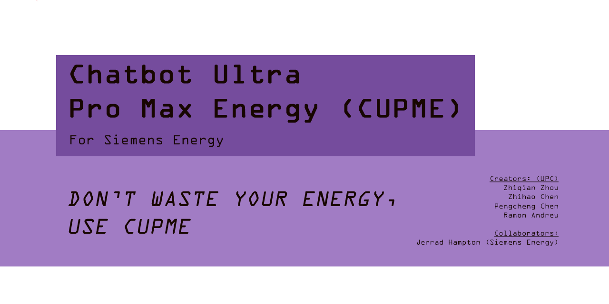

# Chatbot Ultra Pro Max Energy

A Retrieval-Augmented Generation (RAG) based chatbot application specifically designed for Siemens Energy. This intelligent assistant can answer queries about Siemens Energy products, services, and documentation by leveraging a knowledge base with accurate information retrieval.

## 🔍 Overview

This RAG-based chatbot provides Siemens Energy with an intelligent assistant that can retrieve relevant information from a knowledge base and generate accurate, contextually appropriate responses to user queries. The application is built using a modern tech stack and follows best practices for natural language processing and information retrieval.

## ✨ Features

- **Knowledge-Grounded Responses**: Leverages RAG to provide accurate responses based on Siemens Energy documentation
- **Context-Aware Conversations**: Maintains context throughout the conversation
- **Real-time Interaction**: Offers fast response times for enhanced user experience
- **Chat History**: Maintains conversation history for reference
- **User-Friendly Web Interface**: Features an intuitive extension embedded in the web interface for seamless interaction.
- **Voice Interaction**: Supports both voice input and text-to-speech output for hands-free communication.
- **Multilingual Support**: Communicates in English, Spanish, Catalan, and Chinese.
- **Customizable Interface**: Allows users to adjust text size and toggle dark mode for better accessibility.

## 🏗️ Architecture
The application follows a RAG (Retrieval-Augmented Generation) architecture:

- **Vector Database**: Stores embeddings of the knowledge base documents
- **Retriever**: Finds relevant documents based on the user query
- **LLM Response Generator**: Uses a language model to generate responses based on retrieved context
- **LLM Translator**: Translates user queries and chatbot responses to and from the target language, enabling more accurate retrieval using a monolingual embeddings model.
- **Web Interface**: Provides a clean interface for users to interact with the chatbot


## ⚙️ Technology Stack

This project leverages the following technologies:

### Backend

- **LangChain**: Framework for developing applications powered by language models
- **Pinecone**: Vector database for efficient similarity search
- **FastAPI**: High-performance web framework for building APIs
- **Uvicorn**: ASGI server for running the FastAPI application

### Frontend

- **HTML/CSS/JavaScript**: Core web technologies
- **TailwindCSS**: Utility-first CSS framework for styling
- **Web Speech API**: Browser API for voice recognition and text-to-speech

## 🧠 Models Used

This application uses lightweight, efficient, and freely available models optimized for speed and cost-effectiveness:

- **LLM Response Generator**: [Google Gemini 1.5 Flash](https://deepmind.google/discover/blog/gemini-15-pro-and-flash/)  
  A fast, cost-efficient large language model used to generate responses based on retrieved context.

- **Embedding Model**: [BAAI/bge-small-en-v1.5](https://huggingface.co/BAAI/bge-small-en-v1.5)  
  A compact English embedding model from BAAI, ideal for generating semantic embeddings quickly and accurately.


## 🛠️ Installation

### Prerequisites

- Python 3.11+
- API keys for:
  - [Google API](https://console.cloud.google.com/apis/credentials) (for LLM)
  - [Pinecone API](https://app.pinecone.io/) (for vector database)

### Quick Setup

```bash
# Clone and enter repository
git clone https://github.com/randreu27/Chatbot-Ultra-Pro-Max-Energy-CUPME

# Set up virtual environment
python -m venv venv
source venv/bin/activate  # On Windows: venv\Scripts\activate

# Install package
pip install -r requirements.txt.

# Configure API keys
cp .env.example .env
# Edit .env with your API keys
```


## 🖥️ Usage

### Web Scraping
1. Select the page domain you want to scrape and the page where the scrape starts.
2. Execute the main function, with the list of pages and the domain.
```bash
# Enter to the web scraping directory
cd web_scraping

# Run the script to scrape webs and PDFs
python scrap_main.py
```

### Vector Store
1. Place your text files in the RAG/vector_store/product-offerings directory.
2. Create a file_url_pairs.json file in RAG/vector_store to associate each file with its source URL or any other relevant metadata.
>   Note: You can move these directories and files here after running the web scraping module.

3. Edit RAG/vector_store/vector_store_pinecone.py to set up your embedding model and Pinecone connection.

```bash
# Enter to the vector store directory
cd RAG/vector_store

# Create the data directory
mkdir -p product-offerings

# Create or edit the file-URL mapping
vi file_url_pairs.json

# Run the script to populate the vector store
python vector_store_pinecone.py
```

### RAG System

1. Start the backend server:
```bash
# Enter the directory
cd RAG

# Running
python main.py
```
2. The API will be available at http://localhost:8000. Access the application at http://localhost:8000 after starting the backend.

## 🤖 Using the Chatbot

1. Access the web interface through your browser at http://localhost:8000
2. Click the chatbot icon (works like an extension) and choose your preferred language.
3. Type your query related to Siemens Energy in the input field or click the microphone button to use voice input
4. For voice input:

- Ensure your microphone is connected and working
- Click the microphone icon in the chat interface
- In the voice modal that appears, click "Start" to begin speaking
- Speak your question clearly
- Click "Stop" when finished or let it automatically detect when you've stopped speaking
- The voice recognition system will convert your speech to text
- The chatbot will process your query and respond

5. Receive knowledgeable responses based on the Siemens Energy documentation
6. Continue the conversation with follow-up questions as needed, using either text or voice input

> **Tip:** In the chatbot window, click the button in the upper-right corner (Accessibility Options) to adjust text size, switch to dark mode, or enable text-to-speech to listen to responses.

https://github.com/user-attachments/assets/4439c56c-0ef1-4b20-a4e5-31c3ce58d7a9


## 👥 Authors

- **Ramon Andreu**
- **Pengcheng Chen**
- **Zhihao Chen**
- **Zhiqian Zhou**
